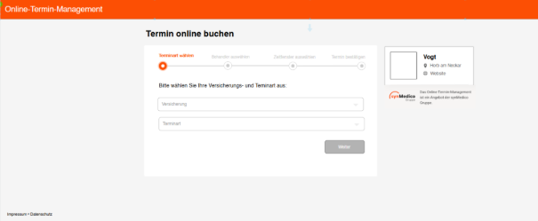

# Ausgangsituation

### Ausgangsituation

Das Terminbuchungssystem besteht aus einem 4-stufigen Workflow, wobei jeder Schritt auf separaten Seiten angezeigt wird. Die Anwendung behält während des gesamten Prozesses das gleiche Grundlayout bei:

1. Navigationsleiste (orange) mit "Online-Termin-Management" und "HILFE"-Button
2. Hauptüberschrift "Termin online buchen"
3. Zweispaltiges Layout:
4. Linke Spalte: Hauptformularkarte mit schrittspezifischen Eingaben
5. Rechte Spalte: Informationskarte mit Anbieter- und Termininformationen

Eine Stepperkomponente zieht sich durch alle Schritte und zeigt das Voranschreiten nur durch die drei Stufen an:

1. "Terminart wählen"
2. "Zeitfenster auswählen"
3. "Termin bestätigen"

Schritte1 – Versicherung und Terminart

- Benutzer wird aufgefordert, Versicherungsart und Terminart auszuwählen
- Klare Anweisungen: "Bitte wählen Sie Ihre Versicherung und Terminart"
- Stepper zeigt dies als aktiven Schritt an
- Keine Schaltfläche
- Termininformation an der rechten Seite zeigt keine Information
- Informationskarte zeigt noch keine Terminangaben

Schitte 2 – Behandler und Termindatum

- Der Benutzer wird aufgefordert, einen Arzt (Behandler) und ein Datum auszuwählen
- Inkonsistenzproblem: Eingabebeschriftungen unterscheiden sich im Stil von Schritt 1
- Stepper zeigt abgeschlossene Schritte in grau an, aber dieser visuelle Hinweis ist unauffällig
- Ausgewählte Daten aus Schritt 1 erscheinen in der Informationskarte unter "Ihre Termininformationen"
- System zeigt Verfügbarkeitsmeldung für das ausgewählte Datum
- UI-Verwirrung: Zwei Zurück-Buttons mit unterschiedlichen Bezeichnungen:
    - "Zurück zu Terminvorschlägen" auf der linken Seite
    - "Schritt zurück" auf der rechten Seite
    - In den vorherigen Schritten wurden keine "Terminvorschläge" angezeigt, was zu Verwirrung führte

Schritt 3: Zeitfensterauswahl

- Verfügbare Zeitfenster werden auf der Grundlage früherer Auswahlen angezeigt
- Zeitfenster werden in einem Rasterformat dargestellt
- Verwirrung auf der Benutzeroberfläche: Die Platzierung der Schaltflächen ist inkonsistent
- Die Schaltflächen "Andere Termine wählen" und "Schritt zurück" stiften Verwirrung über den Navigationsfluss
- Die Positionierung der Schaltflächen entspricht nicht der erwarteten Richtung des Prozessflusses
- Ausgewählte Informationen erscheinen weiterhin in der Informationskarte
- Schritt 4: Persönliche Informationen

Schritt 4: Termin bestätigen

- Formular erfasst persönliche Daten (Name, Geschlecht, Geburtsdatum, Kontaktinformationen)
- Abgeschlossene Schritte im Stepper erscheinen grau mit Häkchen
- Problem der Farbkonsistenz: Graue Häkchen könnten für bessere Sichtbarkeit verbessert werden
- UI confusion: Die Beschriftung der Schaltflächen bleibt inkonsistent
- "Buchung einreichen" und "Schritt zurück" sorgen weiterhin für Verwirrung bei der Navigation

### Soll-Zustand

1. Stepper-Komponente
- Farbkontrast verbessern: Ersetzen Grau durch eine auffälligere Farbe für abgeschlossene Schritte
- die visuelle Hierarchie verbessern: Erhöhen Sie die Sichtbarkeit des aktiven Schritts
- klare Nummerierung hinzufügen: Beibehaltung einer einheitlichen Nummerierung für jeden Schritt
2. Konsistenz der Schaltflächen
- Standardisierung der Schaltflächenanordnung:
- "Zurück"-Schaltflächen einheitlich auf der linken Seite platzieren
- "Weiter/Fortfahren"-Schaltflächen einheitlich auf der rechten Seite platzieren
3. Vereinheitlichen Sie die Beschriftung der Schaltflächen:
- eine einheitliche Terminologie für Navigationsaktionen verwenden
- Die verwirrende Begriffe wie "Zurück zu Terminvorschlägen" durch "Zurück" oder "Vorheriger
- Schritt" ersetzenkonsequent "Weiter" oder "Nächster Schritt" für die Vorwärtsnavigation verwenden
4. User Feedback
- die Auswahlindikatoren verbessern: Deutlicher machen, welche Optionen ausgewählt wurden
- Zeitfensterauswahl verbessern: die Gestaltung des Hintergrunds/Rahmens verbessern, um die ausgewählten Zeitfenster deutlicher zu machen
- Deutlichere Verfügbarkeitsmeldungen: Die Verfügbarkeitsmeldungen sollten deutlicher hervorgehoben werden
5. Form Styling
- Einheitliches Eingabedesign beibehalten: Stellen sicher, dass alle Formularfelder dem gleichen Designmuster folgen
- die Feldbezeichnungen verbessern: eine einheitliche Positionierung und Formatierung der Beschriftungen verwenden
6. Informationskarte
    - Progressive Offenlegung: bei jedem Schritt zeigen nur die relevanten Informationen an
    - Visuelle Hierarchie: Typografie und Abstände verwenden, um die angezeigten Informationen besser zu organisieren.
7. Auf Datenvalidirung achten
- Überprüfung der persönlichen Daten (Name, Geschlecht, Geburtsdatum, E-Mail, Handynummer, usw..)

Große Design:

### Techstack

Laravel 12 mit Blade templates with TailwindCSS, preline

Um das Styling der HTML-Formulare zu beschleunigen, wurden tailwindcss und preline gewählt, damit sie eine eingebaute Fehlermeldung, Validierung, intuitives Aussehen und Design haben können.

### Data

Da die Daten nicht persistiert werden, werden nur Termindaten in der lokalen SQL-Datenbank erstellt. Erstellt mit Tabellenmigration, Seeder. Andernfalls wird die Session zum Speichern der Benutzereingaben verwendet.

Da eloquent erfordert, dass jede Tabelle mit einer Modellklasse verbunden ist, um mit ihr als Entität zu interagieren, zumindest um eine Beziehung zwischen Arzt und verfügbarem Termin als Daten-Dummy zu erstellen, werden Modelle aufgeführt.

Model:

- behandler - Speichert Informationen über Ärzte/Praktiker

id, name, titel, fachgebiet, ist_verfuegbar, timestamps

- terminart - Speichert Arten von Terminen

id, name, dauer, ist_verfuegbar, timestamps

- zeitfenster - Speichert verfügbare Terminfenster

id, behandler_id, datum, start_zeit, end_zeit, ist_verfuegbar, timestamps

- versicherung

id, name, typ

### Architechture Design

Die Anwendung folgt Laravels Implementierung des MVC-Musters (Model-View-Controller):

1. Models – app/Models/ -- Daten und ihre Beziehungen
    - Behandler.php
    - Terminart.php
    - Versicherung.php
    - Zeitfenster
2. Views – resources/views/ --sie werden die HTML Elemente rendern
Der Einfachheit halber werden die Ansichten anonym gehalten und nur zwei als Komponente registriert: Layout und Navbar.
- Layoutvorlagen in resources/views/layouts/
- Buchungsschritte in resources/views/buchung/
- Wiederverwendbare Komponenten in resources/views/components/

3. Controller – app/Http/Contollers/
- TerminbuchungController.php - Verwaltet den Terminbuchungsprozess

User Flow

Die Online Termin Buchung soll 4 Schritten haben:

Der Terminbuchungsprozess besteht aus 4 Schritten:
**Schritt 1: Auswahl der Versicherung und Terminart**
Benutzer wählt die Versicherungsart -> Benutzer wählt die gewünschte Terminart->Daten werden validiert und in der Session gespeichert->Weiter zu Schritt 2
**Schritt 2: Arzt- und Datumsauswahl**
Benutzer wählt einen Arzt -> Benutzer wählt ein Wunschdatum ->System prüft die Verfügbarkeit->Daten werden validiert und in der Session gespeichert->Weiter zu Schritt 3
**Schritt 3: Auswahl des Zeitfensters**
System zeigt verfügbare Zeitfenster->Benutzer wählt ein gewünschtes Zeitfenster->Daten werden validiert, Asyc Abruf zur Prüfen und Nachricht zurück, und in der Session gespeichert->Weiter zu Schritt 4
**Schritt 4: Eingabe persönlicher Daten**
Benutzer gibt persönliche Daten ein (Name, Geschlecht, Geburtsdatum, Kontaktdaten)->System zeigt eine Bestätigungsübersicht->Benutzer bestätigt die Buchung->Destroy Daten

### Front-End Komponenten
Das Terminbuchungssystem weist jeder Route eine eigene Ansicht zu, wobei wiederverwendbare Komponenten (Stepper, Formularkarte, Infokarte, Modal) dynamisch Sitzungs- und Benutzereingabedaten während des mehrstufigen Prozesses anzeigen. Jede streckenspezifische Ansicht verfügt über eine eigene JavaScript-Funktionalität, die ein isoliertes Verhalten gewährleistet und gleichzeitig gemeinsame UI-Komponenten nutzt, wodurch eine modulare Architektur entsteht, die ein Gleichgewicht zwischen Konsistenz und schrittspezifischen Anforderungen schafft.

Geplante Folder-Tree für Viws
resources/views/
├── layouts/
│   └── app.blade.php
├── components/
│   ├── stepper.blade.php
│   ├── navbar.blade.php
│   └── cards/
│   │   ├── form-card.blade.php
│   │   └── info-card.blade.php
│   └── forms/
│       ├── select-field.blade.php
│       ├── date-picker.blade.php
│       └── text-field.blade.php
├── buchung/
│    ├── schritt1.blade.php  # Versicherung, Terminart
│    ├── schritt2.blade.php  # Arzt, Datum
│    ├── schritt3.blade.php  # Zeitfenster
│    ├── schritt4.blade.php  # persönliche Daten
│
├── layouts/
│    └── app.blade.php

Js für DOM,, Datenvalidierung echt-Zeit mit Axio (Asyc) für jede Seite Schritt1-4

resources/css/js
├── buchung/
│   └── schritt1.js
│   ├── schritt2.js
│   ├── schritt3.js
│   ├── schritt4.js

### Routing
Die Routen werden in routes/web.php definiert:
GET /terminbuchung - Zeigt Schritt 1 an
POST /terminbuchung - Verarbeitet Schritt 1 Übermittlung
GET /terminbuchung/behandler - Zeigt Schritt 2 an
POST /terminbuchung/behandler - Verarbeitet Schritt 2
GET /terminbuchung/zeitfenster - Zeigt Schritt 3
POST /terminbuchung/zeitfenster - Verarbeitet Schritt 3 Zeitfenster
GET /terminbuchung/persönlicheDaten - Zeigt Schritt 4
POST /terminbuchung/persönlicheDaten - Verarbeitet Schritt 4
